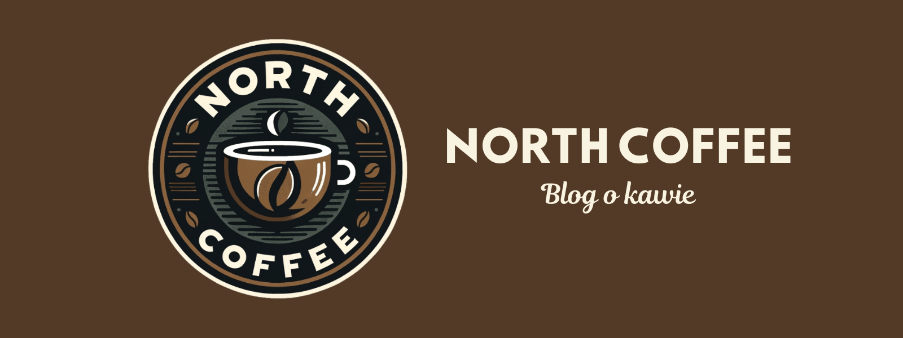
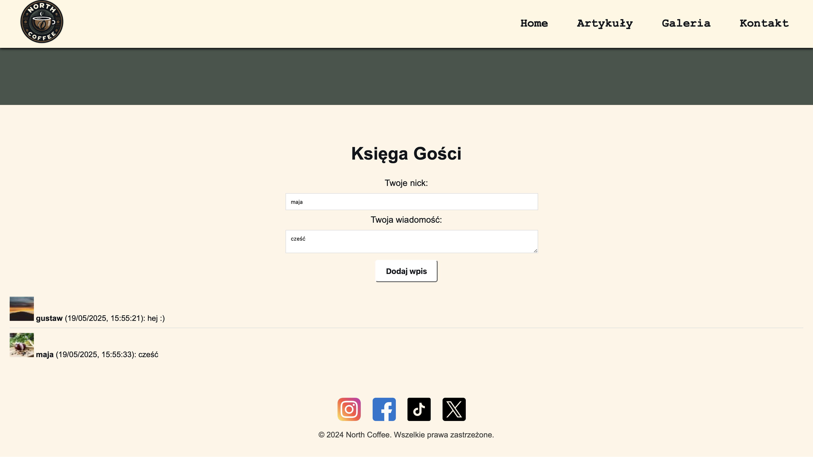
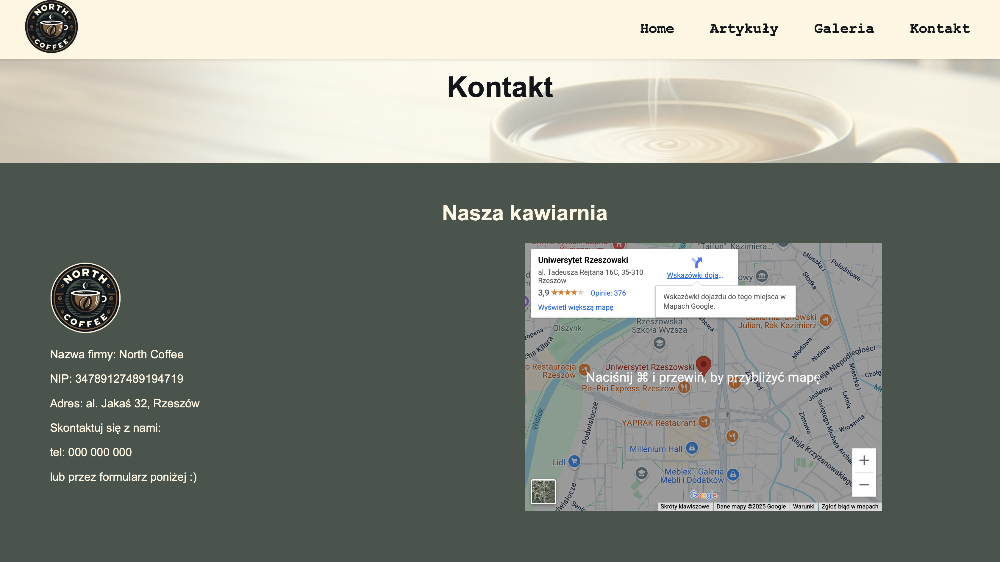
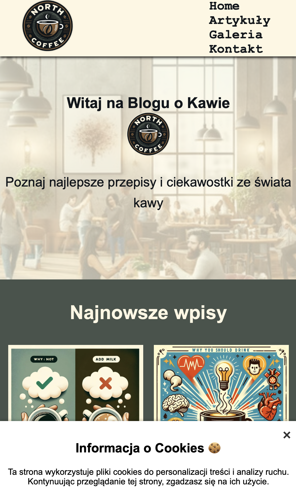

# North Coffee ☕ - Coffee Blog



## Table of Contents

* [Project Description](#project-description)
* [Project Structure](#project-structure)
* [Functionality](#functionality)
* [Responsiveness](#responsiveness)
* [Technologies](#technologies)
* [Installation and Running](#installation-and-running)
* [Testing](#testing)
* [Authors](#authors)
* [License](#license)

## Project Description

North Coffee is a responsive website featuring a coffee blog. The project includes several subpages, such as the home page, articles, a photo gallery, and a contact form. The site is designed following best practices, fully responsive, and optimized for performance and SEO.


## Project Structure

The project consists of the following main files and directories:

* **HTML Pages**:

  * `index.html` – Home page
  * `gallery.html` – Photo gallery
  * `guestbook.html` – Articles and guestbook
  * `contact.html` – Contact form

* **CSS Files**:

  * `style.css` – Styles for the home page
  * `style-gallery.css` – Styles for the gallery
  * `style-guest.css` – Styles for articles and guestbook
  * `style-contact.css` – Styles for the contact form

* **JavaScript**:

  * `js/script.js` – Script handling the guestbook

* **Assets**:

  * `Media/` – Directory containing images and multimedia
  * `Media/Backgrounds/` – Backgrounds for various sections
  * `Media/Articles/` – Article images
  * `Media/Gallery/` – Gallery images
  * `Media/SocialMedia/` – Social media icons

## Functionality

### Home Page

* Eye-catching interactive background
* Latest posts section with hover animations
* Coffee shop reviews with ratings
* "About Me" section
* Simple contact form
* Cookie consent popup


### Articles and Guestbook

* Clean layout for articles
* Scrollable section for all articles
* Interactive guestbook with entry submission
* Entries stored in localStorage



### Gallery

* Carousel showcasing coffee shop photos from different countries
* Interactive photo collections with a stack expansion effect
* Clean layout of gallery items


### Contact

* Contact form with various input fields
* Embedded map showing the coffee shop location
* Company contact details



## Responsiveness

The site is fully responsive across devices, achieved through:

* Flexible layout using Flexbox
* Media queries for different breakpoints
* Scalable images and typography
* Responsive navigation menu for mobile devices



## Technologies

The project utilizes the following technologies:

* **HTML5**
* **CSS3** (Flexbox, Media Queries)
* **JavaScript (ES6+)**
* **LocalStorage API**
* **Google Maps Embed API**
* **Picsum API** (for the guestbook)

## Installation and Running

1. Clone the repository:

   ```bash
   git clone https://github.com/Puegoo/North-Coffee.git
   ```
2. Open `index.html` in your browser or serve via a local server.

## Testing

The site has been tested for:

* **Browser Compatibility**: Chrome, Firefox, Safari, Edge
* **Responsiveness**: Tested on mobile devices, tablets, and desktops
* **HTML/CSS Validation**: Passed W3C validation
* **Performance**: Achieves high scores on Google PageSpeed Insights
* **SEO**: Checked with Seobility

## Authors

* Piotr Nowak ([GitHub](https://github.com/Puegoo))

## License

This project is licensed under the MIT License.
