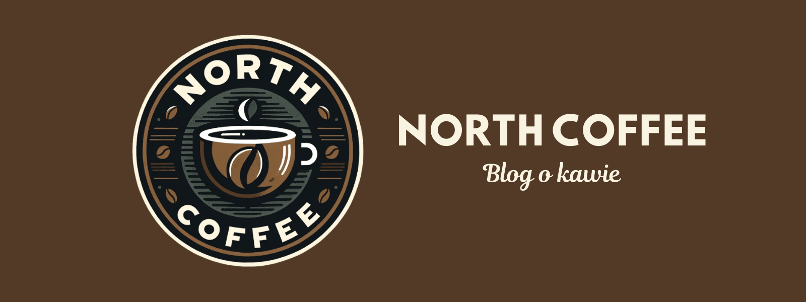

# North Coffee ☕ - Blog o Kawie

## Spis treści
- [Opis projektu](#opis-projektu)
- [Struktura projektu](#struktura-projektu)
- [Funkcjonalność](#funkcjonalność)
- [Responsywność](#responsywność)
- [Technologie](#technologie)
- [Instalacja i uruchomienie](#instalacja-i-uruchomienie)
- [Testowanie](#testowanie)
- [Autorzy](#autorzy)
- [Licencja](#licencja)

## Opis projektu

North Coffee to responsywna strona internetowa przedstawiająca blog o kawie. Projekt zawiera kilka podstron, w tym stronę główną, artykuły, galerię zdjęć oraz formularz kontaktowy. Strona została zaprojektowana zgodnie z najlepszymi praktykami, posiada pełną responsywność i została zoptymalizowana pod kątem wydajności i SEO.

## Struktura projektu

Projekt składa się z następujących głównych plików i katalogów:

- **Strony HTML**:
 - `index.html` - Strona główna
 - `gallery.html` - Galeria zdjęć
 - `guestbook.html` - Artykuły i księga gości
 - `contact.html` - Formularz kontaktowy

- **Pliki CSS**:
 - `style.css` - Style dla strony głównej
 - `style-gallery.css` - Style dla galerii
 - `style-guest.css` - Style dla artykułów i księgi gości
 - `style-contact.css` - Style dla formularza kontaktowego

- **JavaScript**:
 - `js/script.js` - Skrypt obsługujący księgę gości

- **Zasoby**:
 - `Media/` - Katalog zawierający obrazy i multimedia
 - `Media/Backgrounds/` - Tła dla poszczególnych sekcji
 - `Media/Articles/` - Zdjęcia artykułów
 - `Media/Gallery/` - Zdjęcia do galerii
 - `Media/SocialMedia/` - Ikony mediów społecznościowych

## Funkcjonalność

### Strona główna
- Przyciągające wzrok interaktywne tło
- Sekcja najnowszych wpisów z animacjami po najechaniu
- Recenzje kawiarni z ocenami
- Sekcja "O mnie"
- Prosty formularz kontaktowy
- Popup informujący o plikach cookies

### Artykuły i księga gości
- Przejrzysty układ artykułów
- Scrollowalna sekcja wszystkich artykułów
- Interaktywna księga gości z możliwością dodawania wpisów
- Przechowywanie wpisów w localStorage

### Galeria
- Carousel ze zdjęciami kawiarni z różnych krajów
- Interaktywne kolekcje zdjęć z efektem rozwijania stosu
- Przejrzysty układ elementów

### Kontakt
- Formularz kontaktowy z różnymi typami pól
- Mapa lokalizacji kawiarni
- Dane kontaktowe firmy

## Responsywność

Strona została w pełni dostosowana do różnych urządzeń, dzięki zastosowaniu:
- Elastycznego układu opartego na Flexbox
- Media queries dla różnych punktów granicznych
- Skalowania obrazów i tekstu
- Menu responsywnego dla urządzeń mobilnych

## Technologie

Projekt wykorzystuje następujące technologie:

- HTML5
- CSS3 (Flexbox, Media Queries)
- JavaScript (ES6+)
- LocalStorage API
- Google Maps Embed API
- Picsum API (dla księgi gości)

## Instalacja i uruchomienie

1. Sklonuj repozytorium:

`git clone https://github.com/Puegoo/North-Coffee.git`

2. Otwórz plik `index.html` w przeglądarce lub uruchom za pomocą serwera lokalnego:

## Testowanie

Strona została przetestowana pod kątem:

- **Zgodności z przeglądarkami**: Chrome, Firefox, Safari, Edge
- **Responsywności**: Testowana na urządzeniach mobilnych, tabletach i desktopach
- **Walidacji HTML/CSS**: Kod przeszedł walidację W3C
- **Wydajności**: Osiąga wysokie wyniki w Google PageSpeed Insights
- **SEO**: Sprawdzona za pomocą Seobility

## Autorzy

Piotr Nowak ([GitHub](https://github.com/Puegoo))

## Licencja

Ten projekt jest dostępny na licencji MIT.